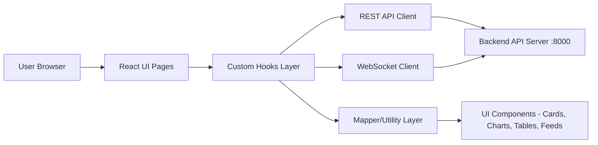

# NUAM Frontend - Network Monitoring and Analysis Dashboard

## Project Title
NUAM Frontend - Network Monitoring and Analysis Dashboard

## Project Description
### Problem Statement
Managing a local area network can be difficult when administrators cannot easily view real-time traffic behavior, device activity, topology changes, and IP utilization in one place.

### Objectives
- Provide a centralized dashboard for real-time network visibility.
- Monitor packet traffic, ARP activity, and device behavior trends.
- Support IP address management and conflict detection workflows.
- Visualize topology and device status for faster troubleshooting.
- Generate date-based summaries and per-device network reports.

### Target Users
- Network administrators
- IT operations teams
- Academic/research users working with LAN monitoring
- Security analysts performing basic anomaly observation

### Overview
This project is a React + TypeScript frontend for NUAM. It consumes HTTP APIs and WebSocket streams from a backend service (default at `localhost:8000`) to present:
- Dashboard metrics and charts
- Network activity analytics (real-time + historical)
- Network topology visualization
- IP address management and alerting
- Daily and per-device reporting

## System Architecture / Design
### High-Level Workflow
1. User opens a module (Dashboard, Topology, Activity, IP Management, Reports).
2. Frontend fetches baseline data from REST endpoints.
3. Frontend subscribes to real-time updates via WebSocket.
4. Hooks transform backend payloads into UI-ready models.
5. Components render tables, cards, charts, and status indicators.

### Architecture Diagram


### Main Components
- `pages/`: Route-level screens (`Dashboard`, `Topology`, `NetworkActivity`, `IPAddressManagement`, `Reports`)
- `hooks/`: Data orchestration and state management (`useDashboardData`, `useTopologyData`, `useNetworkActivityPageData`, etc.)
- `services/`: Backend communication (`api.ts` for REST, `websocket.ts` for real-time)
- `components/`: Reusable UI elements and domain components for dashboard/network/topology
- `layouts/`: Shared shell and navigation (`MainLayout`)
- `lib/`: Utility and mapping helpers

## Technologies Used
### Programming Languages
- TypeScript
- CSS

### Frameworks and Libraries
- React 19
- React Router DOM 7
- Vite (Rolldown variant)
- Tailwind CSS 4
- Recharts
- Radix UI primitives
- Lucide React icons
- class-variance-authority, clsx, tailwind-merge

### Tools
- ESLint
- TypeScript compiler (`tsc`)
- npm

### Backend/Integration
- REST API endpoints (HTTP)
- WebSocket stream (`ws://localhost:8000/ws/frontend`)

### Database
- Not directly used by this frontend (database is managed by backend services)

## Installation Instructions
### Requirements
- Node.js 18+ (recommended latest LTS)
- npm 9+
- NUAM backend service running on `http://localhost:8000`

### Installation Steps
1. Clone the repository.
2. Open terminal in the project root.
3. Install dependencies:

```bash
npm install
```

### Run in Development
```bash
npm run dev
```

The app will start on a local Vite development server (typically `http://localhost:5173`).

### Build for Production
```bash
npm run build
```

### Preview Production Build
```bash
npm run preview
```

### Linting
```bash
npm run lint
```

## Usage Instructions
### How to Use the System
1. Start backend service at `localhost:8000`.
2. Start frontend with `npm run dev`.
3. Open the app in browser.
4. Navigate modules using the main layout:
   - `/` - Dashboard
   - `/topological-view` - Topology
   - `/network-activity` - Activity analytics
   - `/ip-management` - IP address management
   - `/reports` - Date/device reports

### Example Inputs
- Select time range (`5m`, `1h`, `24h`) in Network Activity.
- Select report date and device in Reports page.
- Search IP/MAC/hostname in IP Management table.

### Example Outputs
- Real-time metric cards (packets per second, active devices, ARP rate).
- Traffic and ARP trend charts.
- Device activity table and event feed.
- Topology view with device details.
- Daily summary and per-device report details.

## Dataset
No static dataset is bundled in this frontend repository.

The system primarily consumes live backend-generated network telemetry and reporting data over:
- HTTP API (`/api/reports/...`)
- WebSocket stream (`/ws/frontend`)

If you use external datasets in your deployment/testing, document their source and license here.

## Project Structure
```text
nuam-frontend/
|- public/
|- src/
|  |- assets/
|  |- components/
|  |  |- DashboardComponents/
|  |  |- network/
|  |  |- topology/
|  |  \- ui/
|  |- hooks/
|  |- layouts/
|  |- lib/
|  |- pages/
|  |- services/
|  |- App.tsx
|  |- main.tsx
|  |- index.css
|  \- App.css
|- components.json
|- eslint.config.js
|- tailwind.config.js
|- tsconfig.json
|- tsconfig.app.json
|- tsconfig.node.json
|- vite.config.ts
|- package.json
\- README.md
```

## Screenshots / Demo
Add project visuals here:
- Dashboard overview screenshot
- Topology page screenshot
- Network activity charts screenshot
- IP management page screenshot
- Reports page screenshot

Recommended structure:
```text
docs/
|- screenshots/
|  |- dashboard.png
|  |- topology.png
|  |- activity.png
|  |- ip-management.png
|  \- reports.png
\- demo-video-link.txt
```

Demo video: Add your URL here (YouTube/Drive/etc.)

## Contributors
| Name | Role | Responsibilities |
|------|------|------------------|
| Naveen Hettiwaththa | Fullstack Developer | UI components, pages, UX |
| Sandaru Samintha | Frontend Developer | API and WebSocket integration |
| Ravindu Peshan | Fullstack Developer | Testing, API and WebSocket integration |
| Kaveesha Vihangi | Frontend Developer | Testing, API and WebSocket integration |

## Contact Information
- Name: Naveen Hettiwaththa
- Email: naveenhettiwaththa@gmail.com
- Institution: University Of Jaffna

## License
This project is licensed under the MIT License. See the [LICENSE](./LICENSE) file for the full text.
